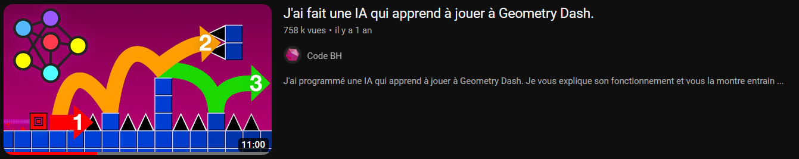
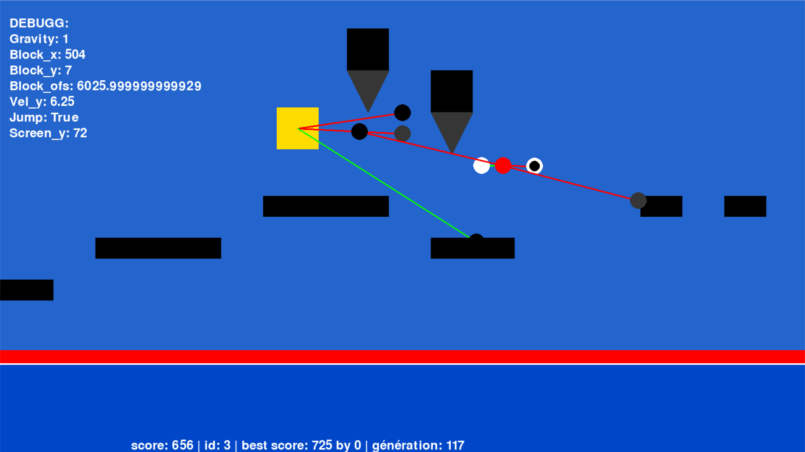

# PyDash AI
Geometry Dash made with Python using PyGame.

This projet is made by using the engine by AcruxGD ([here](https://github.com/AcruxGD/PyDash.git)) using pygame.

The learning method is inspired by the CodeBh [video](https://youtu.be/MTcXW94V838?si=XPXf2aNzE3n5Rfrn).


# Implementation (added by me)

- Debugg hud
- PPO algorithme
- Slow Time
- Pause
- 1 more spike

# Controls

> - **escape** : stop the game
> - **p** : pause and play the simulation
> - **q** : slow the time
> - **d** : show the debugg text
> - **f** : hide the debugg text
> - **a** : draw sensor and neurones
> - **z** : draw sensor
> - **e** : draw neurones
> - **r** : draw nothing



# How it's work ?
First we creat 50 agents with a random brain. A brain is a group of neurones, and a neurone is a group of sensors.
```python
 brain = [neurone1, neurone2, neurone3]
 neurone1 = [sensor_x, sensor_y, sensor_type]
 neurone2 = [sensor_x, sensor_y, sensor_type]
 neurone3 = [sensor_x, sensor_y, sensor_type]
```
In each generation we play each agent and we note their score when they die.
Then, we take the agent who went the furthest (the highest score), then we do 49 modified iterations of his brain.
Finally we start the process again.
#### Sensor types

> - 1: presence of black pixel (block)
> - 2: presence of grey pixel (spike)
> - 3: presence of not a grey or black pixel (nothing)
> - 4: presence of a not black pixel (not a block)
> - 5: prensence of a not grey pixel (not a spike)
> - 6: presence of a a grey or a black pixel (a block or a spike)

# Files

- PYDASH_AI
    - PyDash
        - asset
            - BaseAfterBase.mp3 #music of the game
            - explode.mp3 #sound of the death
            - level_1.png #the first level(png is used to creat level)
            - level_2.png
        
        - data
            - agents.csv #all the brains from the current generation
            - best.csv #keep  track of the evolution
            - settings.csv #settings like the mod, the window resolution

        - clean_best.py #delet best generation withe the same brain
        - menu.py #select your settings and launch the project
        - PyDash.py #the game
    
    - #files for the presentation
---
*last update: 01/03/2024*